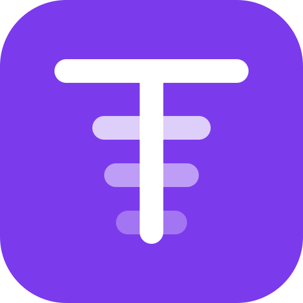

<div align="center">
  
  <h1>Tokens</h1>
  <p><strong>AI 编程用量排行榜——自托管。</strong></p>
  <p>
    <a href="./README.md">English</a> ·
    <a href="./docs/deploy/self-host-production.md">部署清单</a> ·
    <a href="./docs/deploy/tokens-cli-usage.md">CLI 手册</a>
  </p>
</div>

---

你每天都在烧 token。Tokens 把这些变成一份公开战绩：今天跑了多少、按客户端和模型怎么拆、你在团队和全站排第几。

这是一个**自托管 fork**：Web 应用和 Postgres 都跑在你自己的服务器、自己的域名下。没有现成的官方实例可注册——部署是一等有文档支持的路径，不是事后补的。

## 这是什么

一个面向 AI 编程用量的排行榜 + 团队榜。CLI 扫描你机器上已安装的 AI 客户端，在本地汇总用量，只提交汇总数据。Web 端提供全站榜和 Team/Group 两级组织榜，带个人主页、贡献图和可嵌入卡片。

## 本 fork 与上游的差异

Fork 链路：[junhoyeo/tokscale](https://github.com/junhoyeo/tokscale) → [missuo/tokens](https://github.com/missuo/tokens) → 本仓库。CLI 与上游完全一致；站点全面分叉：

| | 上游（missuo/tokens） | 本 fork |
|---|---|---|
| 认证 | GitHub OAuth | 邮箱 + 密码（PBKDF2）；无 GitHub 登录 |
| 组织 | 单一全局榜 | Team / Group 两级；Teamboard 支持 Team 单选 + Group 多选筛选 |
| 文案 | 仅英文 | 全站中英文 i18n，带语言切换 |
| 品牌 | 上游蓝色 | 品牌紫 `#7C3AED` |
| 部署 | Cloudflare Workers + Neon（经 Hyperdrive） | 自建 Node（`next start`）+ 自建 Postgres，带生产 Docker 资产 |
| 反作弊 | 跨设备去重、单调性校验、公开 Hall of Shame | 同样保留校验与封禁；公示页已移除 |

**上游同步策略**见 [docs/upstream_policy.md](./docs/upstream_policy.md)：数据能力与正确性修复照收，UI 实现不照搬。

## 隐私

CLI 读取的是你机器上 AI 客户端本来就会写盘的会话文件，在本地汇总后**只上传汇总数据**——token 数、模型名、客户端名、时间戳。Prompt、补全内容、文件内容与路径永远不离开你的机器。`tokens submit --dry-run` 会打印将要上传的内容。整条管线可读：`cli/tokens-core/src/sessions/`（每个客户端一个解析器）和 `cli/tokens-cli/src/commands/`（提交路径）。

因为是自托管，数据也躺在你自己的 Postgres 里。

## 安装 CLI 并指向你的站

**macOS**

```sh
brew install owo-network/brew/tokens
```

**Linux**

```sh
curl -fsSL https://<你的域名>/install.sh | sh
```

**Windows**（或任何有 Bun/Node 18+ 的环境一次性使用）

```sh
npm i -g tokens-cli        # 或：bunx tokens-cli@latest <命令>
```

然后任意平台：

```sh
tokens logout                                       # 清掉其他站的旧凭据
TOKENS_API_URL=https://<你的域名> tokens login       # 浏览器打开 <你的域名>/device 授权
TOKENS_API_URL=https://<你的域名> tokens submit
```

每条命令都要带 `TOKENS_API_URL`（或在当前 shell 里 export 一次）——CLI 默认指向上游站，凭据也不记自己属于哪个站。仓库根目录还提供 `pre-install-tokens.sh` / `pre-install-tokens.ps1` 一键预安装脚本：装 CLI、清旧凭据、把默认指向固定到你的站。可直接从本仓库的 GitHub 公开地址远程执行（钉住审过的 tag 或 commit，不跟随分支漂移）：

```sh
curl -fsSL https://raw.githubusercontent.com/KunoLu/tokens/v1.0.1/pre-install-tokens.sh | bash -s -- https://<你的域名>
```

预装完成后，`enable-tokens-service.sh`（Linux）与 `register-tokens-submit-task.ps1`（Windows）可配置常驻自动提交——由你部署的站点提供下载，docs 页有现成命令，详见手册。

详见 [docs/deploy/tokens-cli-usage.md](./docs/deploy/tokens-cli-usage.md)。

## 自托管站点

生产 = 你自己的 Node 服务 + 你自己的 Postgres：

- **部署清单**——[docs/deploy/self-host-production.md](./docs/deploy/self-host-production.md)（blocker、环境变量、验收）
- **生产 Docker 资产**——[docs/deploy/docker/prod/](./docs/deploy/docker/prod/)（多阶段 Dockerfile、compose、操作手册；`docker compose up -d --build` 即部署/发版）
- **本地开发栈**——[docs/deploy/docker/dev/](./docs/deploy/docker/dev/)（OrbStack/Docker Compose 参考副本）

## 支持的客户端

41 个客户端全部自动检测——只要装过并写过会话，就会被统计。CLI 核心与上游一致，上游的解析器、定价源和正确性修复在本仓库持续可用。

<details>
<summary>各客户端的数据存放位置</summary>

| 客户端 | 数据位置 |
|---|---|
| [Claude Code](https://docs.anthropic.com/en/docs/claude-code) | `~/.claude/projects/`、`~/.claude/transcripts/` |
| [Codex CLI](https://github.com/openai/codex) | `~/.codex/sessions/` |
| [OpenCode](https://github.com/sst/opencode) | `~/.local/share/opencode/opencode.db`（1.2+）或 `~/.local/share/opencode/storage/message/` |
| [Cursor](https://cursor.com/) | API 导出缓存在 `~/.config/tokens/cursor-cache/usage*.csv` |
| [Copilot CLI](https://docs.github.com/en/copilot) | `~/.copilot/otel/*.jsonl` |
| [Gemini CLI](https://github.com/google-gemini/gemini-cli) | `~/.gemini/tmp/*/chats/*.json` |
| [Kimi CLI](https://github.com/MoonshotAI/kimi-cli) | `~/.kimi/sessions/` |
| [Qwen CLI](https://github.com/QwenLM/qwen-cli) | `~/.qwen/projects/` |
| Reasonix | `~/.reasonix/stats/*.jsonl`（可用 `REASONIX_STATE_HOME` 或 `REASONIX_HOME` 覆盖） |
| [Amp](https://ampcode.com/) | `~/.local/share/amp/threads/` |
| [Droid](https://factory.ai/) | `~/.factory/sessions/` |
| [Cline](https://github.com/cline/cline) | VS Code globalStorage tasks，或 Cline CLI/桌面端在 `~/.cline/data/sessions/` |
| [Roo Code](https://github.com/RooCodeInc/Roo-Code) | VS Code globalStorage tasks |
| [Kilo](https://github.com/Kilo-Org/kilocode) | VS Code globalStorage tasks |
| [Kilo CLI](https://github.com/nicepkg/kilo) | `~/.local/share/kilo/kilo.db` |
| [Crush](https://crush.ai/) | `$XDG_DATA_HOME/crush/projects.json` |
| [Goose](https://github.com/aaif-goose/goose) | `~/.local/share/goose/sessions/sessions.db` |
| [Mux](https://github.com/coder/mux) | `~/.mux/sessions/` |
| [Pi](https://github.com/badlogic/pi-mono) | `~/.pi/agent/sessions/`、`~/.omp/agent/sessions/` |
| [Zed Agent](https://zed.dev/docs/ai/agent-panel) | `~/.local/share/zed/threads/threads.db` |
| Kiro | `~/.kiro/sessions/cli/`、`~/.local/share/kiro-cli/data.sqlite3` |
| [Warp](https://www.warp.dev/) / Oz | `tokens warp sync` → `~/.config/tokens/warp-cache/usage.json` |
| [Trae](https://www.trae.ai/) | `tokens trae sync` → `~/.config/tokens/trae-cache/sessions/` |
| [Antigravity](https://antigravity.google/) | `tokens antigravity sync` → `~/.config/tokens/antigravity-cache/sessions/` |
| [OpenClaw](https://openclaw.ai/) | `~/.openclaw/agents/` |
| [Codebuff](https://codebuff.com/) | `~/.config/manicode/` |
| [Hermes](https://github.com/NousResearch/hermes-agent) | `$HERMES_HOME/state.db` |
| [Synthetic](https://synthetic.new/) | 经 `hf:` 模型前缀或 `synthetic` provider 重新归因 |
| [Fx](https://github.com/vercel-labs/fx) | `~/.fx/sessions/<sessionId>/usage-v2.json`（按会话聚合） |

</details>

只通过账号 API 暴露用量的客户端需要先做一次同步——`tokens cursor sync`、`tokens antigravity sync`、`tokens trae sync`、`tokens warp sync`——之后就和其它客户端一样提交。

定价数据来自 [LiteLLM](https://github.com/BerriAI/litellm)、[OpenRouter](https://openrouter.ai) 和 [models.dev](https://github.com/anomalyco/models.dev)，按模型取最优匹配费率。

## 仓库结构

```text
cli/                 Rust workspace——tokens CLI（与上游一致）
web/                 Next.js 应用——排行榜、团队榜、认证、个人主页、embed
packages/            npm 分发包（CLI 主包 + 各平台二进制）
docs/deploy/         自托管部署（清单、Docker 资产、CLI 手册）
docs/upstream_policy.md   上游改动的评估与合并策略
web/features/        BDD 行为规格（中文场景 + 英文关键词）
tests/e2e/           Playwright 端到端测试
```

## 许可证

MIT——见 [LICENSE](./LICENSE)。

基于 [Tokscale](https://github.com/junhoyeo/tokscale)（作者 [Junho Yeo](https://github.com/junhoyeo)），经由 [missuo/tokens](https://github.com/missuo/tokens)。原始设计与实现的 credit 归上游作者与贡献者。
